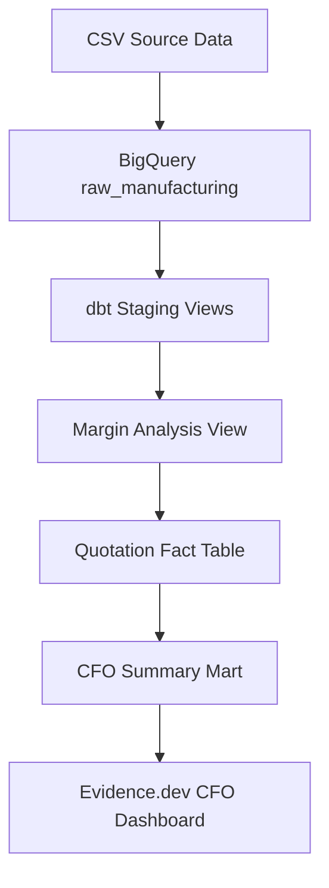
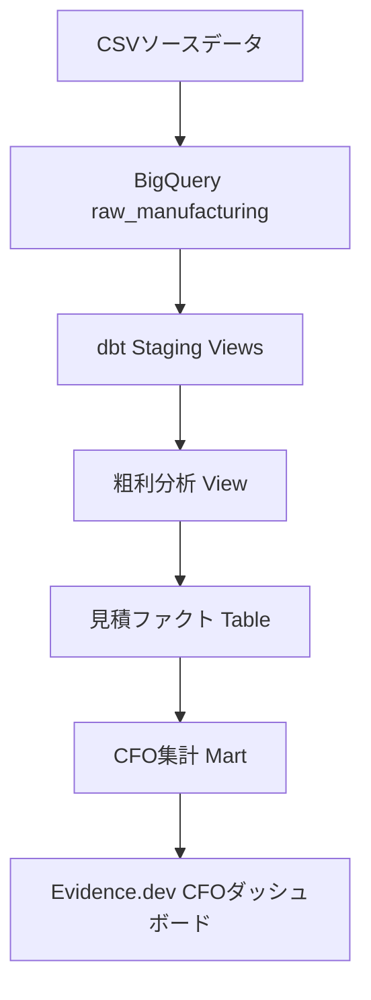

[English](#english) | [日本語](#japanese)

<a id="english"></a>

# AeroPrecision Industrial — Quotation Analytics & Margin Governance

A production-oriented analytics engineering case study built with **Google BigQuery** and **dbt Core**.

The project demonstrates how a B2B precision manufacturer can reduce RFQ response delays, enforce CFO gross-margin policies, identify revenue leakage, and compare AI-automated quotations with manual sales quotations.

> This repository uses synthetic manufacturing and quotation data created for demonstration and portfolio purposes. It contains no real customer or company-confidential information.

## Business Problem

AeroPrecision Industrial is a fictional B2B precision machining and industrial equipment manufacturer.

Its quotation process faces two major operational risks:

1. Slow manual RFQ responses reduce the probability of winning an order.
2. Manual pricing exceptions can violate the CFO's target gross-margin policy.

The analytics foundation answers the following executive questions:

- Does faster quotation response improve win rates?
- How does AI-automated quoting perform against manual quoting?
- Which quotations violate the CFO margin threshold?
- How many margin-violating quotes became costly won deals?
- How much potential revenue leakage is associated with those deals?
- Which product categories and response-speed bands require management attention?

## Architecture



Current implementation scope:

```text
CSV
→ BigQuery Raw Layer
→ dbt Staging Layer
→ dbt Intermediate Layer
→ dbt Marts
→ Data Quality Tests
→ dbt Documentation
```

Planned extensions:

```text
GitHub Actions CI/CD
→ Evidence.dev Executive BI
→ n8n Autonomous Quotation Workflow
→ Langfuse LLM Observability
```

## Technology Stack

| Component | Technology |
|---|---|
| Data warehouse | Google BigQuery |
| Transformation | dbt Core 1.11.12 |
| BigQuery adapter | dbt-bigquery 1.11.3 |
| Development environment | Windows 11, PowerShell, Python 3.13 |
| Version control | Git and GitHub |
| Authentication | Google OAuth Application Default Credentials |
| CI/CD | GitHub Actions — planned |
| Executive BI | Evidence.dev — planned |
| AI workflow orchestration | n8n — planned |
| LLM observability | Langfuse — planned |

## Source Data

The synthetic source data represents twelve months of B2B quotation activity.

| Source | Description | Rows |
|---|---|---:|
| `src_products` | Product specifications, manufacturing costs, labor requirements, and CFO margin targets | 40 |
| `src_transactions` | Historical RFQs, response times, quoted prices, sales outcomes, and margin flags | 1,000 |

Key dataset characteristics:

- 200 AI-automated quotations
- 800 manual quotations
- Exactly 18 margin-policy violations
- 5 margin-violating quotations that became won deals
- Zero unmatched product IDs
- Twelve months of chronologically ordered quotation history

## dbt Model Layers

### Staging

| Model | Purpose |
|---|---|
| `stg_products` | Standardizes product descriptions, categories, materials, costs, labor rates, and CFO margin targets |
| `stg_transactions` | Cleans quotation records and derives quotation method and response-speed classifications |

### Intermediate

| Model | Purpose |
|---|---|
| `int_quote_margin_analysis` | Joins products and quotations and calculates costs, achieved margins, CFO-approved prices, governance status, and revenue leakage |

### Marts

| Model | Materialization | Purpose |
|---|---|---|
| `fct_quotation_performance` | Table | Quote-level analytical fact table for pricing, response, margin, and sales-performance analysis |
| `mart_cfo_quote_summary` | Table | Monthly CFO summary by quotation method, response-speed band, and product category |

## Core Business Logic

### Estimated Total Cost

```text
Adjusted unit cost
= Raw material cost × (1 + material surcharge)
  + estimated labor hours × hourly labor rate

Estimated total cost
= Adjusted unit cost × requested quantity
```

### CFO-Approved Minimum Price

```text
Minimum approved price
= Estimated total cost ÷ (1 − CFO target gross margin)
```

### Actual Gross Margin

```text
Actual gross margin
= (Quoted price − Estimated total cost) ÷ Quoted price
```

### Revenue Leakage

A quotation is classified as a costly bad deal when:

```text
Actual gross margin < CFO target gross margin
AND
Status = Won
```

Revenue leakage is calculated as the difference between the CFO-approved minimum price and the actual quoted price for won margin violations.

## CFO Metrics

The CFO summary mart provides:

- Total quotations
- Won and lost quotations
- Win rate
- Average quote response time
- Total quoted value
- Won revenue and gross profit
- Margin-violation count
- Won margin-violation deals
- Margin-compliance rate
- Revenue leakage
- Average target and achieved gross margins
- Average margin variance

The aggregation grain is:

```text
Quote month
× Quote method
× Response-speed band
× Product category
```

## Data Quality and Governance

The project contains **55 automated data tests**, covering primary-key uniqueness, required-field completeness, accepted values, foreign-key integrity, policy compliance, and fact-to-summary reconciliation.

Key singular business-rule tests:

| Test | Governance objective |
|---|---|
| `assert_exactly_18_margin_violations` | Confirms the expected number of policy violations |
| `assert_margin_violation_flags_consistent` | Reconciles source flags with independently calculated margin results |
| `assert_ai_quotes_follow_cfo_policy` | Ensures automated quotes follow the CFO margin rule |
| `assert_won_violations_have_revenue_leak` | Ensures costly won deals carry a positive revenue-leak value |
| `assert_cfo_summary_unique_grain` | Prevents duplicate CFO summary rows |
| `assert_cfo_summary_reconciles` | Reconciles fact and summary totals, violations, wins, and revenue leakage |

Latest full build result:

```text
PASS=60
WARN=0
ERROR=0
SKIP=0
TOTAL=60
```

This represents five successful model builds and 55 successful data tests.

## Project Structure

```text
aeroprecision_industrial/
├── models/
│   ├── staging/
│   │   ├── _sources.yml
│   │   ├── _staging_models.yml
│   │   ├── stg_products.sql
│   │   └── stg_transactions.sql
│   ├── intermediate/
│   │   └── int_quote_margin_analysis.sql
│   └── marts/
│       ├── _marts.yml
│       ├── fct_quotation_performance.sql
│       └── mart_cfo_quote_summary.sql
├── tests/
│   ├── assert_ai_quotes_follow_cfo_policy.sql
│   ├── assert_cfo_summary_reconciles.sql
│   ├── assert_cfo_summary_unique_grain.sql
│   ├── assert_exactly_18_margin_violations.sql
│   ├── assert_margin_violation_flags_consistent.sql
│   └── assert_won_violations_have_revenue_leak.sql
├── dbt_project.yml
└── README.md
```

## Local Setup

### Prerequisites

- Python 3.13
- Git
- Google Cloud SDK
- Access to a BigQuery project
- dbt Core and dbt-bigquery

### Install dbt

```powershell
python -m pip install dbt-core==1.11.12 dbt-bigquery==1.11.3
```

### Authenticate with Google Cloud

```powershell
gcloud auth application-default login
gcloud auth application-default set-quota-project YOUR_GCP_PROJECT_ID
gcloud config set project YOUR_GCP_PROJECT_ID
```

### Configure the dbt Profile

Create a local `profiles.yml` outside the repository at:

```text
C:\Users\<username>\.dbt\profiles.yml
```

Example:

```yaml
aeroprecision_industrial:
  target: dev
  outputs:
    dev:
      type: bigquery
      method: oauth
      project: YOUR_GCP_PROJECT_ID
      dataset: analytics_manufacturing
      location: US
      threads: 4
      job_execution_timeout_seconds: 300
```

No credentials or service-account keys should be committed to this repository.

### Validate, Build, and Document

```powershell
dbt debug
dbt build --full-refresh
dbt docs generate
dbt docs serve
```

Open `http://localhost:8080` to view the generated documentation and lineage.

## BigQuery Sandbox Consideration

BigQuery Sandbox automatically expires tables and partitions after a limited retention period.

During development, date-partitioned mart tables retained only approximately 60 days of the twelve-month quotation history, reducing the fact table from 1,000 to 151 records. The reconciliation test detected this data loss.

For the Sandbox demonstration environment, the affected marts were changed to unpartitioned clustered tables, restoring all 1,000 records. In a billing-enabled production environment, date partitioning should be reintroduced with an appropriate retention and cost-management policy.

## Security Design

- Local development uses OAuth Application Default Credentials.
- Credential files are stored outside the repository.
- `.gitignore` excludes local environments, logs, generated artifacts, and credential files.
- Raw-data read access and analytics write access are separated.
- GitHub Actions will use Workload Identity Federation instead of long-lived JSON service-account keys.
- The dbt service account follows least-privilege access principles.
- The `main` branch is protected by a ruleset that requires pull requests and a successful dbt CI check.

## Roadmap

- [x] Load synthetic manufacturing data into BigQuery
- [x] Implement staging, intermediate, and mart layers
- [x] Implement CFO margin-governance calculations
- [x] Add automated data-quality and governance tests
- [x] Generate dbt documentation and lineage
- [x] Publish the dbt project to GitHub
- [ ] Configure keyless GitHub-to-GCP authentication
- [ ] Add GitHub Actions CI/CD
- [ ] Build an Evidence.dev CFO dashboard
- [ ] Implement the n8n autonomous quotation workflow
- [ ] Add Langfuse monitoring and evaluation
- [ ] Publish the complete architecture and executive case study

## Author

**Atsushi Mano**<br>
Manufacturing DX and AI/Data Automation Leader<br>
Purdue MBA<br>
Founder and CEO, Seren

Focus areas:

- Manufacturing operations transformation
- Analytics engineering and data governance
- AI-enabled quotation automation
- CFO margin and revenue-leak governance
- Modern data stack architecture

---

<a id="japanese"></a>

# AeroPrecision Industrial — 見積分析・マージンガバナンス基盤

Google BigQueryとdbt Coreを使用して構築した、実運用を想定したアナリティクスエンジニアリングのケーススタディです。

B2B精密加工メーカーにおける見積回答の遅延、CFO粗利ルールの不遵守、低マージン受注による収益漏出を、データ変換・品質テスト・経営分析によって管理する仕組みを実装しています。

> 本リポジトリでは、ポートフォリオおよび技術検証を目的として作成した合成データを使用しています。実在する企業、顧客、取引、機密情報は含まれていません。

## 解決するビジネス課題

AeroPrecision Industrialは、B2B精密加工および産業機器を製造する架空企業です。

従来の見積プロセスには、主に次の2つの経営リスクがあります。

1. 手動見積の回答遅延によって受注確率が低下する
2. 営業担当者による価格例外がCFOの目標粗利率を下回る

このデータ基盤では、次の経営課題を分析できます。

- 見積回答の高速化は受注率向上につながるか
- AI自動見積と手動見積の成果にどのような差があるか
- どの見積がCFOの粗利ルールに違反しているか
- マージン違反案件のうち、実際に受注された案件はいくつあるか
- 低価格受注によって、どれだけのRevenue Leakが発生したか
- どの製品カテゴリーや回答速度区分に経営上の問題があるか

## アーキテクチャ



現在の実装範囲：

```text
CSV
→ BigQuery Raw層
→ dbt Staging層
→ dbt Intermediate層
→ dbt Marts層
→ データ品質テスト
→ dbtドキュメント
```

今後の拡張予定：

```text
GitHub Actions CI/CD
→ Evidence.dev 経営ダッシュボード
→ n8n 自律型見積ワークフロー
→ Langfuse LLM監視
```

## 技術スタック

| 領域 | 採用技術 |
|---|---|
| データウェアハウス | Google BigQuery |
| データ変換 | dbt Core 1.11.12 |
| BigQueryアダプター | dbt-bigquery 1.11.3 |
| 開発環境 | Windows 11、PowerShell、Python 3.13 |
| バージョン管理 | Git、GitHub |
| ローカル認証 | Google OAuth Application Default Credentials |
| CI/CD | GitHub Actions（実装予定） |
| 経営BI | Evidence.dev（実装予定） |
| AIワークフロー | n8n（実装予定） |
| LLM監視 | Langfuse（実装予定） |

## ソースデータ

12か月分のB2B見積活動を再現した合成データを使用しています。

| ソース | 内容 | 件数 |
|---|---|---:|
| `src_products` | 製品仕様、製造原価、労務費、CFO目標粗利率 | 40 |
| `src_transactions` | 見積履歴、回答時間、価格、受注結果、違反フラグ | 1,000 |

データの主要な特徴：

- AI自動見積：200件
- 手動見積：800件
- マージンルール違反：18件
- 受注されたマージン違反：5件
- 製品マスタと一致しない製品ID：0件
- 12か月分の時系列見積履歴

## dbtモデル構成

### Staging層

| モデル | 役割 |
|---|---|
| `stg_products` | 製品名、カテゴリー、材料、原価、労務費、CFO目標粗利率を標準化 |
| `stg_transactions` | 見積履歴をクレンジングし、見積方法と回答速度区分を生成 |

### Intermediate層

| モデル | 役割 |
|---|---|
| `int_quote_margin_analysis` | 製品と見積を結合し、実績原価、実績粗利率、CFO承認価格、違反状態、Revenue Leakを計算 |

### Marts層

| モデル | 形式 | 役割 |
|---|---|---|
| `fct_quotation_performance` | Table | 見積単位の価格、回答速度、粗利、受注実績を保持するファクト |
| `mart_cfo_quote_summary` | Table | 月、見積方法、回答速度、製品カテゴリー別のCFO向け集計 |

## 主要な計算ロジック

### 推定総原価

```text
調整後単位原価
= 材料原価 ×（1 + 材料サーチャージ率）
  + 標準労働時間 × 時間単価

推定総原価
= 調整後単位原価 × 見積数量
```

### CFO承認最低価格

```text
CFO承認最低価格
= 推定総原価 ÷（1 − CFO目標粗利率）
```

### 実績粗利率

```text
実績粗利率
=（見積価格 − 推定総原価）÷ 見積価格
```

### Revenue Leak

次の両方を満たす場合、収益性に問題のある受注案件として判定します。

```text
実績粗利率 < CFO目標粗利率
AND
受注ステータス = Won
```

Revenue Leakは、CFO承認最低価格と実際の見積価格との差額として計算します。

## CFO向けKPI

CFO集計マートでは、次のKPIを提供します。

- 見積件数
- 受注件数・失注件数
- 受注率
- 平均見積回答日数
- 見積総額
- 受注売上・受注粗利益
- マージン違反件数
- 受注されたマージン違反件数
- マージン遵守率
- Revenue Leak
- 平均目標粗利率・平均実績粗利率
- 平均粗利差異

集計単位：

```text
見積月
× 見積方法
× 回答速度区分
× 製品カテゴリー
```

## データ品質とガバナンス

合計**55個の自動データテスト**を実装しています。主キーの一意性、必須項目、許容値、外部キー整合性、ポリシー遵守、ファクトと集計の照合を検証します。

| テスト | 検証内容 |
|---|---|
| `assert_exactly_18_margin_violations` | マージン違反が正確に18件存在すること |
| `assert_margin_violation_flags_consistent` | 保存された違反フラグと再計算結果が一致すること |
| `assert_ai_quotes_follow_cfo_policy` | AI見積がCFOの粗利ルールを遵守すること |
| `assert_won_violations_have_revenue_leak` | 受注された違反案件に正のRevenue Leakが存在すること |
| `assert_cfo_summary_unique_grain` | CFO集計の同一粒度に重複行がないこと |
| `assert_cfo_summary_reconciles` | ファクトとCFO集計の件数・違反・収益漏出が一致すること |

最新の全体ビルド結果：

```text
PASS=60
WARN=0
ERROR=0
SKIP=0
TOTAL=60
```

5モデルの構築と55個のデータテストが、すべて正常に完了しています。

## プロジェクト構成

```text
aeroprecision_industrial/
├── models/
│   ├── staging/
│   ├── intermediate/
│   └── marts/
├── tests/
├── dbt_project.yml
└── README.md
```

## ローカル環境での実行方法

### 必要環境

- Python 3.13
- Git
- Google Cloud SDK
- BigQueryプロジェクトへのアクセス権
- dbt Coreおよびdbt-bigquery

### Google Cloud認証

```powershell
gcloud auth application-default login
gcloud auth application-default set-quota-project YOUR_GCP_PROJECT_ID
gcloud config set project YOUR_GCP_PROJECT_ID
```

### 接続・構築・ドキュメント生成

```powershell
dbt debug
dbt build --full-refresh
dbt docs generate
dbt docs serve
```

`http://localhost:8080` を開くと、生成されたドキュメントとデータリネージュを確認できます。

## BigQuery Sandboxへの対応

BigQuery Sandboxでは、テーブルやパーティションに保存期限があります。

開発中、日付パーティションを設定したマートで、12か月分の1,000件が直近約60日分の151件まで減少する問題が発生しました。ファクトとCFO集計の照合テストによって、このデータ欠落を検出しました。

Sandbox環境では対象マートを非パーティション・クラスターテーブルへ変更し、1,000件すべてを復旧しています。課金が有効な本番環境へ移行する場合は、保存期間とコスト管理方針を設定したうえで、日付パーティションを再導入します。

## セキュリティ設計

- ローカル環境ではOAuth Application Default Credentialsを使用
- 認証ファイルはGitリポジトリ外に保存
- `.gitignore` で認証情報、ログ、仮想環境、生成物を除外
- Rawデータの閲覧権限とAnalyticsへの書込権限を分離
- GitHub Actionsでは長期JSONキーを使用しない
- Workload Identity Federationによるキーレス認証を採用予定
- 最小権限のサービスアカウントを使用
- `main`ブランチはRulesetで保護され、Pull Requestとdbt CIの成功をマージ条件として設定

## ロードマップ

- [x] 合成製造データをBigQueryへロード
- [x] Staging、Intermediate、Marts層を実装
- [x] CFOマージンガバナンスを実装
- [x] 自動データ品質テストを実装
- [x] dbt Docsとデータリネージュを生成
- [x] dbtプロジェクトをGitHubへ公開
- [ ] GitHubとGCPのキーレス認証
- [ ] GitHub Actions CI/CD
- [ ] Evidence.dev CFOダッシュボード
- [ ] n8n自律型見積ワークフロー
- [ ] LangfuseによるLLM監視
- [ ] 最終アーキテクチャと経営ケーススタディの公開

## 作成者

**真野敦**<br>
製造業DX・AI／データオートメーションリーダー<br>
Purdue MBA<br>
せれん株式会社 代表取締役

専門領域：

- 製造オペレーション変革
- アナリティクスエンジニアリング
- データガバナンス
- AI見積自動化
- CFOマージン・Revenue Leak管理